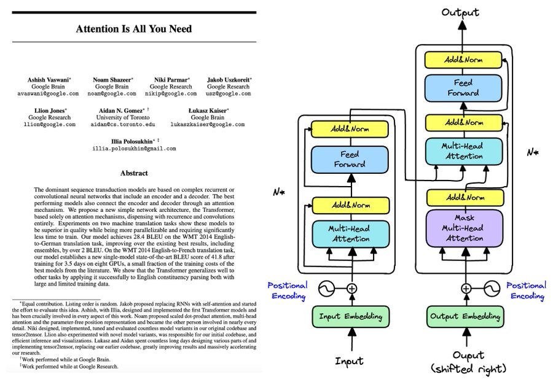

# Transformer from scratch

>**Open-source implementation** of the Transformer architecture, based on the paper [*Attention Is All You Need*](https://arxiv.org/abs/1706.03762) (Vaswani et al., 2017), enriched with my personal notes and explanations.

<p style="text-align: center;">
  
</p>

This project provides a complete implementation of the ``Transformer architecture`` for **English → French Translation**. Built entirely from scratch with ``PyTorch``, it demonstrates the **full end-to-end pipeline from data acquisition and preprocessing to inference**.

It aims to be:

- **Minimal**: the implementation mirrors the paper's architecture (multi-head attention, positional encodings, and the encoder-decoder design), as a way for me to deepen my own understanding
- **Modular**: distinct modules handle data preprocessing, model architecture, training workflows, and evaluation, ensuring clarity and easy expansion
- **Customizable**: hyperparameters can be adjusted to reproduce the base, big, or smaller Transformer variants (number of layers, hidden size, dropout, ...)
- **Hands-on**: provides end-to-end scripts for downloading and preprocessing datasets (like ``WMT14`` in this work), training models on ``NVIDIA GPU (CUDA)`` machines, and assessing performance using ``BLEU`` scores

### Key Features

- **Complete Transformer Implementation**: full encoder-decoder architecture with multi-head attention, positional encoding, and feed-forward networks
- **Compute Optimization**: efficient attention computation, KV Caching memory structure for inference optimization
- **End-to-End Pipeline**: data download, preprocessing, training, evaluation, and inference
- **BPE Tokenization**: SentencePiece-based byte-pair encoding for robust subword tokenization
- **Training Best Practices**: label smoothing, gradient clipping, learning rate warmup, early stopping
- **Comprehensive Evaluation**: BLEU score computation with sample translations
- **Flexible Inference**

## Dataset

The project uses the **WMT14 English-French** dataset, which includes:
- [**Europarl v7**](https://www.statmt.org/europarl/v7/): European Parliament proceedings
- [**Common Crawl**](https://www.statmt.org/wmt13): Web-scraped parallel corpus
- [**News Commentary**](https://www.statmt.org/wmt14): News articles and commentary

The dataset can be automatically downloaded and preprocessed.

## Requirements

```bash
python -m venv .venv
.venv\Scripts\activate
# source .venv/bin/activate  # Linux/Mac
uv sync
```

## Usage

### 0. Notes: [transformer.ipynb](./src/notebooks/transformer+notes.ipynb)
This notebook-based implementation of the architecture with some personal notes and explanations can be helpful.

### 1. Download Dataset

Download the WMT14 English-French dataset:

```bash
python -m src.data.download_data

# optional arguments
python -m src.data.download_data --data-dir ./custom/path
```

### 2. Preprocess Data

Split the dataset and train SentencePiece BPE model:

```bash
python -m src.data.preprocess_data

# optional arguments
python -m src.data.preprocess_data \
    --raw-dir ./src/data/raw \
    --processed-dir ./src/data/processed \
    --vocab-size 32000 \
    --max-sentences 200000 \
    --train-ratio 0.98 \
    --val-ratio 0.01
```
This creates:
- Train/validation/test splits
- SentencePiece BPE model (`sp_bpe.model`)
- BPE-encoded files (`.bpe` extension)

### 3. Train Model

Train the Transformer model:

```bash
python -m src.scripts.train

# optional arguments:
python -m src.scripts.train \
    --d-model 512 \
    --heads 8 \
    --d-ff 2048 \
    --num-layers 6 \
    --dropout 0.1 \
    --batch-size 16 \
    --epochs 10 \
    --lr 5e-4 \
    --max-seq-len 512 \
    --warmup-steps 4000 \
    --early-stopping-patience 3 \
    --model-name my_model
```
The model checkpoint will be saved to `src/scripts/checkpoints/`.

### 4. Evaluate Model

Evaluate the trained model and compute BLEU score:

```bash
python -m src.scripts.evaluate --model-name best --num-samples 5

# optional arguments
python -m src.scripts.evaluate \
    --model-name best \
    --checkpoints-path ./custom/path/model.pt \
    --results-file results \
    --num-samples 10 \
    --batch-size 16
```
This will:
- Compute BLEU score on the test set
- Display sample translations
- Save results to JSON file

### 5. Inference

Translate English sentences to French using the trained model.


```bash
# Interactive Mode
python -m src.scripts.inference --model-name best --interactive

# Single Sentence
python -m src.scripts.inference --model-name best --sentence "Hello, my name is zedems!"

# Batch File Translation
python -m src.scripts.inference \
    --model-name best \
    --input-file sentences.txt \
    --output-file translations.txt \
    --batch-size 8
```

## Project Structure

```bash
training-transformer-from-scratch/
├── src/
│   ├── data/
│   │   ├── download_data.py      # Download WMT14 dataset
│   │   ├── preprocess_data.py    # Data preprocessing & BPE training
│   │   ├── raw/                  # Raw dataset files
│   │   └── processed/            # Processed data & BPE model
│   ├── notebooks/
│   │   └── transformer+note.ipynb   # Implementation + notes
│   ├── scripts/
│   │   ├── train.py              # Training script
│   │   ├── evaluate.py           # Evaluation script
│   │   ├── inference.py          # Inference script
│   │   ├── transformer.py        # Transformer architecture
│   │   ├── utils.py              # Helper functions
│   │   └── checkpoints/          # Saved model checkpoints
│   └── config.py                 # Configuration file
├── README.md
└── pyproject.toml
```

## Notes

- **GPU Required**: Training requires CUDA-capable GPU
- **Memory Usage**: Adjust batch size based on available GPU memory
- **Training Time**: Depends on dataset size and model configuration
- **Checkpoints**: Best model is saved based on validation loss

## Citation

```bibtex
@article{vaswani2017attention,
  title={Attention is all you need},
  author={Vaswani, Ashish and Shazeer, Noam and Parmar, Niki and Uszkoreit, Jakob and Jones, Llion and Gomez, Aidan N and Kaiser, Lukasz and Polosukhin, Illia},
  journal={Advances in neural information processing systems},
  volume={30},
  year={2017}
}
```
